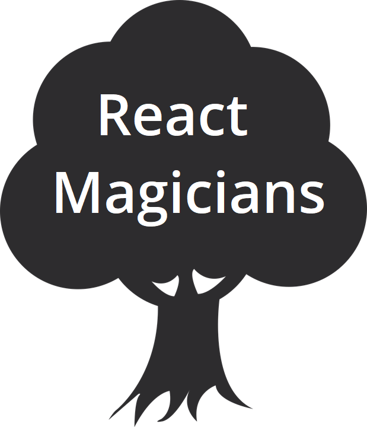

## Hi there 👋, I am Sagramielgo: proud programmer. <a href="https://twitter.com/sagramielgo"></a>


<hr/>
<h3> My Projects :</h3>
  
  
<a href="https://sagramielgo.github.io/characters-finder-rick-and-morty-Sagramielgo/">  Rick & Morty.</a> API rest, React, Grid, animations.

<a href="https://sagramielgo.github.io/tvseries-finder-Sagramielgo/"> Tv series finder.</a> JavaScript, Flex-box.

<a href="https://sagramielgo-react-magicians.herokuapp.com/"> React Magicians.</a> Refactorize to React a JavaScript inherited code.
Node js, Express js, servers y database SQLite.

<a href="https://sagramielgo.github.io/sagramielgo-dev-rockets"> DevRockets.</a> Layout HTML5, SASS, responsive mobile first.

<hr/>

I always wanted to be a singer, a teacher and an astronaut.
My professional experience has been linked to music, communication, tv and radio.

I have travelled around the world, I have worked in Japan, Argentina, UK and different Spanish cities. I am an inquisitive person and a cultural diversity lover.
I am self-taught in editing my own audio-visual material, my computer has been my travel partner.

All these experiences helped me develop technical and managerial skills, such as: adaptability and empathy to understand the needs of each project. At work and in my personal life, I believe in team work.
Formed in [@Adalab](https://github.com/Adalab) I am taking off as a front-end developer with enthusiasm.
Houston, the countdown is starting 🚀.

<hr/>
<h3> My CV </h3> (CV icons and text are clickable)

[](https://www.canva.com/design/DAEaU8W_i84/qZWsi-I_RYcK2CYh-fXd8w/view?utm_content=DAEaU8W_i84&utm_campaign=designshare&utm_medium=link&utm_source=sharebutton) 🔗
[](https://www.canva.com/design/DAEZ2Mtwndk/uHBzisZEzudrN5JEoOykcw/view?utm_content=DAEZ2Mtwndk&utm_campaign=designshare&utm_medium=link&utm_source=sharebutton) 🔗

<hr/>

## A little more about me:

```javascript
let Sagra = {
😄 pronouns: "she" | "her",
🤹🏼 softSkills: ["perseverance", "team-working", "empathy", "creativity", "adaptability" ],
⚙️ currentlyWorkingOn: "communication and front-end projects",
🚧 iAmLookingFor: "fun and creative programming",
💬 AskMeAbout: "Whatever you want!"
}
```

I would also love to have a good conversation about:

- 🎬 Series & cinema (I love sci-fy).
- 🎸 Music, specially jazz and real book standards.
- ✈️ Travelling, around the world.
- 🏅 Sports, specially running. I'm a marathon runner, yesssss.
- 🐕 Animals, I love them all.

Let's talk!

Take a look to one of my project demos 📽️ [devRockets](https://www.youtube.com/watch?v=pdzEJnlMqdA)

And also you can sing (lyrics in Spanish) this song I wrote about programming 🎵 [Indéntame](https://www.youtube.com/watch?v=gmcnZGeIjNk&t=2s)

<hr/>
<!-- ⚡ Fun fact: ... ,
🌱 I’m currently learning:
👯 I’m looking to collaborate on ... ,
🤔 I’m looking for help with ...  -->,

## 📫 How to reach me:

<a href="https://www.linkedin.com/in/sagramielgo/"></a>
<a href="https://github.com/sagramielgo"></a>
<a href="mailto:sagramielgo@gmail.com"></a>
<a href="https://twitter.com/sagramielgo"></a>

#### 📑 References:

- Emojis from [Emojipedia](https://emojipedia.org/).
- Icons from [SimpleIcons](https://simpleicons.org/).

<!-- [If you liked this ✨ _special_ ✨ repository, please do not forget to star it.](url)-->
